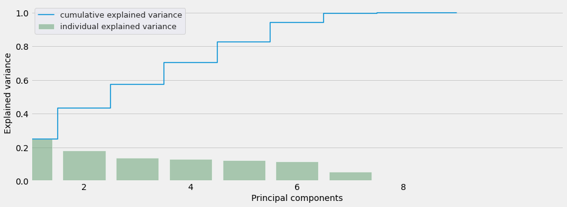
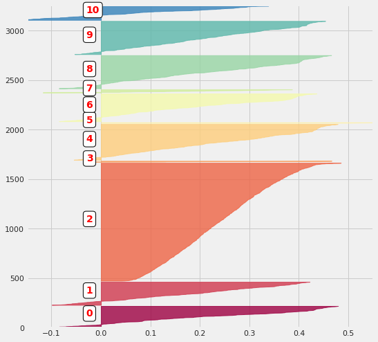
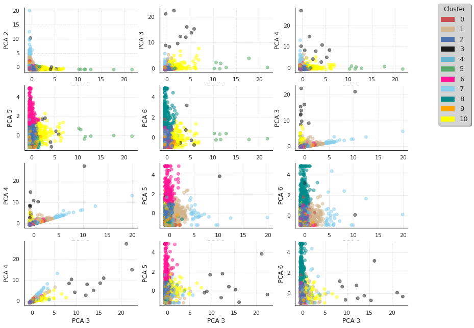

# Featurologists
> Data transformations toolkit made by team 2 at Engineering Labs #2 "Feature Store for ML"


## Installation

`pip install -U git+https://github.com/artemlops/featurologists.git@master`

## Usage

### 01. Load and split dataset

```
import datetime
from featurologists.data.load_split import load_data_csv, split_by_invoice_date

ONLINEOFFLINE_DATE_SPLIT = datetime.date(2011,10,1)

print('Loading original dataset')
df = load_data_csv('../data/data.csv')
display(df.head())

print('Splitting dataset to offline and online parts')
df_offline, df_online = split_by_invoice_date(df, ONLINEOFFLINE_DATE_SPLIT)

display(df_offline.shape)
display(df_offline['InvoiceDate'].min())
display(df_offline['InvoiceDate'].max())

display(df_online.shape)
display(df_online['InvoiceDate'].min())
display(df_online['InvoiceDate'].max())
```

    Loading original dataset


<div>
<style scoped>
    .dataframe tbody tr th:only-of-type {
        vertical-align: middle;
    }

    .dataframe tbody tr th {
        vertical-align: top;
    }

    .dataframe thead th {
        text-align: right;
    }
</style>
<table border="1" class="dataframe">
  <thead>
    <tr style="text-align: right;">
      <th></th>
      <th>InvoiceNo</th>
      <th>StockCode</th>
      <th>Description</th>
      <th>Quantity</th>
      <th>InvoiceDate</th>
      <th>UnitPrice</th>
      <th>CustomerID</th>
      <th>Country</th>
    </tr>
  </thead>
  <tbody>
    <tr>
      <th>0</th>
      <td>536365</td>
      <td>85123A</td>
      <td>WHITE HANGING HEART T-LIGHT HOLDER</td>
      <td>6</td>
      <td>2010-12-01 08:26:00</td>
      <td>2.55</td>
      <td>17850</td>
      <td>United Kingdom</td>
    </tr>
    <tr>
      <th>1</th>
      <td>536365</td>
      <td>71053</td>
      <td>WHITE METAL LANTERN</td>
      <td>6</td>
      <td>2010-12-01 08:26:00</td>
      <td>3.39</td>
      <td>17850</td>
      <td>United Kingdom</td>
    </tr>
    <tr>
      <th>2</th>
      <td>536365</td>
      <td>84406B</td>
      <td>CREAM CUPID HEARTS COAT HANGER</td>
      <td>8</td>
      <td>2010-12-01 08:26:00</td>
      <td>2.75</td>
      <td>17850</td>
      <td>United Kingdom</td>
    </tr>
    <tr>
      <th>3</th>
      <td>536365</td>
      <td>84029G</td>
      <td>KNITTED UNION FLAG HOT WATER BOTTLE</td>
      <td>6</td>
      <td>2010-12-01 08:26:00</td>
      <td>3.39</td>
      <td>17850</td>
      <td>United Kingdom</td>
    </tr>
    <tr>
      <th>4</th>
      <td>536365</td>
      <td>84029E</td>
      <td>RED WOOLLY HOTTIE WHITE HEART.</td>
      <td>6</td>
      <td>2010-12-01 08:26:00</td>
      <td>3.39</td>
      <td>17850</td>
      <td>United Kingdom</td>
    </tr>
  </tbody>
</table>
</div>


    Splitting dataset to offline and online parts


    (370931, 8)


    Timestamp('2010-12-01 08:26:00')


    Timestamp('2011-09-30 17:22:00')


    (170978, 8)


    Timestamp('2011-10-02 10:32:00')


    Timestamp('2011-12-09 12:50:00')


```
OUT_DATA = f'../data/output/01_data_split_offline_online'
!mkdir -p {OUT_DATA}

df_offline.to_csv(f'{OUT_DATA}/no_live_data.csv', index=False)
df_online.to_csv(f'{OUT_DATA}/raw_live_data.csv', index=False)
with open(f'{OUT_DATA}/onlineoffline_date_split.txt', 'w') as f:
    f.write(str(ONLINEOFFLINE_DATE_SPLIT))
```

### 02. Clean dataset rows

```
from featurologists.data.load_split import load_data_csv
from featurologists.data.clean_rows import clean_data_rows

print('Loading raw offline dataset')
df = load_data_csv('../data/output/01_data_split_offline_online/no_live_data.csv')

print('Cleaning raw offline dataset')
df_cleaned = clean_data_rows(df)
```

    Loading raw offline dataset
    Cleaning raw offline dataset


```
OUT_DATA = f'../data/output/02_data_clean_rows'
!mkdir -p {OUT_DATA}

df_cleaned.to_csv(f'{OUT_DATA}/no_live_data__cleaned.csv', index=False)
```

### 03. Analyse purchases

```
import datetime
from sklearn.metrics import silhouette_samples, silhouette_score

from featurologists.data.load_split import load_data_csv, split_by_invoice_date
from featurologists.data.analyse_purchases import (
    build_product_list,
    build_keywords_matrix,
    compute_purchase_clusters,
    plot_silhouette,
    add_purchase_clusters_info,
)

N_PURCHASE_CLUSTERS = 5
TRAINTEST_DATE_SPLIT = datetime.date(2011,8,1)

print('Loading cleaned dataset')
df_cleaned = load_data_csv('../data/output/02_data_clean_rows/no_live_data__cleaned.csv')
list_products = build_product_list(df_cleaned)
display(pd.DataFrame(list_products).head())
```

    Loading cleaned dataset


    /plain/github/mine/featurologists/venv/lib/python3.7/site-packages/IPython/core/interactiveshell.py:3361: DtypeWarning: Columns (0) have mixed types.Specify dtype option on import or set low_memory=False.
      if (await self.run_code(code, result,  async_=asy)):


<div>
<style scoped>
    .dataframe tbody tr th:only-of-type {
        vertical-align: middle;
    }

    .dataframe tbody tr th {
        vertical-align: top;
    }

    .dataframe thead th {
        text-align: right;
    }
</style>
<table border="1" class="dataframe">
  <thead>
    <tr style="text-align: right;">
      <th></th>
      <th>0</th>
      <th>1</th>
    </tr>
  </thead>
  <tbody>
    <tr>
      <th>0</th>
      <td>heart</td>
      <td>251</td>
    </tr>
    <tr>
      <th>1</th>
      <td>vintage</td>
      <td>195</td>
    </tr>
    <tr>
      <th>2</th>
      <td>set</td>
      <td>194</td>
    </tr>
    <tr>
      <th>3</th>
      <td>bag</td>
      <td>158</td>
    </tr>
    <tr>
      <th>4</th>
      <td>box</td>
      <td>147</td>
    </tr>
  </tbody>
</table>
</div>


```
print('Building keywords count matrix')
THRESHOLD = [0, 1, 2, 3, 5, 10]
matrix = build_keywords_matrix(df_cleaned, list_products, THRESHOLD)
display(matrix.head(), matrix.shape)
```

    Building keywords count matrix


<div>
<style scoped>
    .dataframe tbody tr th:only-of-type {
        vertical-align: middle;
    }

    .dataframe tbody tr th {
        vertical-align: top;
    }

    .dataframe thead th {
        text-align: right;
    }
</style>
<table border="1" class="dataframe">
  <thead>
    <tr style="text-align: right;">
      <th></th>
      <th>heart</th>
      <th>vintage</th>
      <th>set</th>
      <th>bag</th>
      <th>box</th>
      <th>glass</th>
      <th>christmas</th>
      <th>design</th>
      <th>candle</th>
      <th>flower</th>
      <th>...</th>
      <th>medium</th>
      <th>hen</th>
      <th>wallet</th>
      <th>point</th>
      <th>0&lt;.&lt;1</th>
      <th>1&lt;.&lt;2</th>
      <th>2&lt;.&lt;3</th>
      <th>3&lt;.&lt;5</th>
      <th>5&lt;.&lt;10</th>
      <th>.&gt;10</th>
    </tr>
  </thead>
  <tbody>
    <tr>
      <th>0</th>
      <td>1</td>
      <td>0</td>
      <td>0</td>
      <td>0</td>
      <td>0</td>
      <td>0</td>
      <td>0</td>
      <td>0</td>
      <td>0</td>
      <td>0</td>
      <td>...</td>
      <td>0</td>
      <td>0</td>
      <td>0</td>
      <td>0</td>
      <td>0</td>
      <td>0</td>
      <td>1</td>
      <td>0</td>
      <td>0</td>
      <td>0</td>
    </tr>
    <tr>
      <th>1</th>
      <td>0</td>
      <td>0</td>
      <td>0</td>
      <td>0</td>
      <td>0</td>
      <td>0</td>
      <td>0</td>
      <td>0</td>
      <td>0</td>
      <td>0</td>
      <td>...</td>
      <td>0</td>
      <td>0</td>
      <td>0</td>
      <td>0</td>
      <td>0</td>
      <td>0</td>
      <td>0</td>
      <td>1</td>
      <td>0</td>
      <td>0</td>
    </tr>
    <tr>
      <th>2</th>
      <td>1</td>
      <td>0</td>
      <td>0</td>
      <td>0</td>
      <td>0</td>
      <td>0</td>
      <td>0</td>
      <td>0</td>
      <td>0</td>
      <td>0</td>
      <td>...</td>
      <td>0</td>
      <td>0</td>
      <td>0</td>
      <td>0</td>
      <td>0</td>
      <td>0</td>
      <td>0</td>
      <td>1</td>
      <td>0</td>
      <td>0</td>
    </tr>
    <tr>
      <th>3</th>
      <td>0</td>
      <td>0</td>
      <td>0</td>
      <td>0</td>
      <td>0</td>
      <td>0</td>
      <td>0</td>
      <td>0</td>
      <td>0</td>
      <td>0</td>
      <td>...</td>
      <td>0</td>
      <td>0</td>
      <td>0</td>
      <td>0</td>
      <td>0</td>
      <td>0</td>
      <td>0</td>
      <td>1</td>
      <td>0</td>
      <td>0</td>
    </tr>
    <tr>
      <th>4</th>
      <td>1</td>
      <td>0</td>
      <td>0</td>
      <td>0</td>
      <td>0</td>
      <td>0</td>
      <td>0</td>
      <td>0</td>
      <td>0</td>
      <td>0</td>
      <td>...</td>
      <td>0</td>
      <td>0</td>
      <td>0</td>
      <td>0</td>
      <td>0</td>
      <td>0</td>
      <td>0</td>
      <td>1</td>
      <td>0</td>
      <td>0</td>
    </tr>
  </tbody>
</table>
<p>5 rows × 188 columns</p>
</div>


    (3662, 188)


```
print('Computing purchases clusters via Kmeans')
clusters = compute_purchase_clusters(matrix, N_PURCHASE_CLUSTERS)
display(pd.Series(clusters).value_counts())
```

    Computing purchases clusters via Kmeans


    2    980
    3    911
    4    709
    0    638
    1    424
    dtype: int64


```
print('Plotting silhouette values')
silhouette_avg = silhouette_score(matrix, clusters)
sample_silhouette_values = silhouette_samples(matrix, clusters)
plot_silhouette(N_PURCHASE_CLUSTERS, [-0.07, 0.33], len(matrix), sample_silhouette_values, clusters)
```

    Plotting silhouette values


```
print('Constructing the result DataFrame')
df_with_clusters = add_purchase_clusters_info(df_cleaned, clusters, N_PURCHASE_CLUSTERS)
display(df_with_clusters)
```

    Constructing the result DataFrame


<div>
<style scoped>
    .dataframe tbody tr th:only-of-type {
        vertical-align: middle;
    }

    .dataframe tbody tr th {
        vertical-align: top;
    }

    .dataframe thead th {
        text-align: right;
    }
</style>
<table border="1" class="dataframe">
  <thead>
    <tr style="text-align: right;">
      <th></th>
      <th>CustomerID</th>
      <th>InvoiceNo</th>
      <th>Basket Price</th>
      <th>categ_0</th>
      <th>categ_1</th>
      <th>categ_2</th>
      <th>categ_3</th>
      <th>categ_4</th>
      <th>InvoiceDate</th>
    </tr>
  </thead>
  <tbody>
    <tr>
      <th>1</th>
      <td>12347</td>
      <td>537626</td>
      <td>711.79</td>
      <td>83.40</td>
      <td>124.44</td>
      <td>187.20</td>
      <td>23.40</td>
      <td>293.35</td>
      <td>2010-12-07 14:57:00.000001024</td>
    </tr>
    <tr>
      <th>2</th>
      <td>12347</td>
      <td>542237</td>
      <td>475.39</td>
      <td>53.10</td>
      <td>0.00</td>
      <td>130.50</td>
      <td>84.34</td>
      <td>207.45</td>
      <td>2011-01-26 14:29:59.999999744</td>
    </tr>
    <tr>
      <th>3</th>
      <td>12347</td>
      <td>549222</td>
      <td>636.25</td>
      <td>71.10</td>
      <td>0.00</td>
      <td>330.90</td>
      <td>81.00</td>
      <td>153.25</td>
      <td>2011-04-07 10:42:59.999999232</td>
    </tr>
    <tr>
      <th>4</th>
      <td>12347</td>
      <td>556201</td>
      <td>382.52</td>
      <td>78.06</td>
      <td>19.90</td>
      <td>74.40</td>
      <td>41.40</td>
      <td>168.76</td>
      <td>2011-06-09 13:01:00.000000256</td>
    </tr>
    <tr>
      <th>5</th>
      <td>12347</td>
      <td>562032</td>
      <td>584.91</td>
      <td>119.70</td>
      <td>97.80</td>
      <td>109.70</td>
      <td>61.30</td>
      <td>196.41</td>
      <td>2011-08-02 08:48:00.000000000</td>
    </tr>
    <tr>
      <th>...</th>
      <td>...</td>
      <td>...</td>
      <td>...</td>
      <td>...</td>
      <td>...</td>
      <td>...</td>
      <td>...</td>
      <td>...</td>
      <td>...</td>
    </tr>
    <tr>
      <th>13239</th>
      <td>18283</td>
      <td>557956</td>
      <td>192.80</td>
      <td>60.94</td>
      <td>0.00</td>
      <td>71.12</td>
      <td>43.34</td>
      <td>17.40</td>
      <td>2011-06-23 19:20:00.000000000</td>
    </tr>
    <tr>
      <th>13240</th>
      <td>18283</td>
      <td>560025</td>
      <td>137.39</td>
      <td>39.73</td>
      <td>0.00</td>
      <td>53.53</td>
      <td>27.53</td>
      <td>16.60</td>
      <td>2011-07-14 13:00:00.000000000</td>
    </tr>
    <tr>
      <th>13241</th>
      <td>18283</td>
      <td>560032</td>
      <td>2.50</td>
      <td>0.00</td>
      <td>0.00</td>
      <td>2.50</td>
      <td>0.00</td>
      <td>0.00</td>
      <td>2011-07-14 13:20:00.000000000</td>
    </tr>
    <tr>
      <th>13242</th>
      <td>18283</td>
      <td>565579</td>
      <td>134.90</td>
      <td>43.34</td>
      <td>0.00</td>
      <td>58.26</td>
      <td>29.30</td>
      <td>4.00</td>
      <td>2011-09-05 12:34:59.999998720</td>
    </tr>
    <tr>
      <th>13243</th>
      <td>18287</td>
      <td>554065</td>
      <td>765.28</td>
      <td>134.70</td>
      <td>34.00</td>
      <td>540.90</td>
      <td>40.68</td>
      <td>15.00</td>
      <td>2011-05-22 10:38:59.999998976</td>
    </tr>
  </tbody>
</table>
<p>13081 rows × 9 columns</p>
</div>


```
print('Splitting the new dataset (offline + cluster info) to train+test')
df_offline_train, df_offline_test = split_by_invoice_date(df_with_clusters, TRAINTEST_DATE_SPLIT)
display(df_offline_train.shape, df_offline_test.shape)
```

    Splitting the new dataset (offline + cluster info) to train+test


    (10054, 9)


    (3027, 9)


```
OUT_DATA = f'../data/output/03_data_compute_description_keywords'
!mkdir -p {OUT_DATA}

matrix.to_csv(f'{OUT_DATA}/no_live_data__cleaned__keywords.csv', index=False)
df_offline_train.to_csv(f'{OUT_DATA}/no_live_data__cleaned__purchase_clusters__train.csv', index=False)
df_offline_test.to_csv(f'{OUT_DATA}/no_live_data__cleaned__purchase_clusters__test.csv', index=False)

pd.DataFrame(THRESHOLD, columns=['threshold']).to_csv(f'{OUT_DATA}/threshold.csv', index=False)
with open(f'{OUT_DATA}/n_purchase_clusters.txt', 'w') as f:
    f.write(str(N_PURCHASE_CLUSTERS))
with open(f'{OUT_DATA}/traintest_date_split.txt', 'w') as f:
    f.write(str(TRAINTEST_DATE_SPLIT))
```

### 04. Analyse customer categories

```
from sklearn.metrics import silhouette_samples, silhouette_score

from featurologists.data.load_split import load_data_csv
from featurologists.data.analyse_purchases import plot_silhouette
from featurologists.data.analyse_customers import (
    build_transactions_per_user,
    plot_customers_pca,
    convert_customers_df_to_np,
    analyse_customers_pca,
    compute_customer_clusters,
    plot_customer_categories,
    add_customer_clusters_info,
    compute_aggregated_customer_clusters_info,
)

N_CUSTOMER_CLUSTERS = 11
SELECTED_CUSTOMERS_CATEG_THRESHOLD = 40


print('Loading cleaned offline train dataset')
DATA = '../data/output/03_data_compute_description_keywords'
with open(f'{DATA}/n_purchase_clusters.txt', 'r') as f:
    N_PURCHASE_CLUSTERS = int(f.read())
basket_price = load_data_csv(f'{DATA}/no_live_data__cleaned__purchase_clusters__train.csv')
display(basket_price.head())
```

    Loading cleaned offline train dataset


<div>
<style scoped>
    .dataframe tbody tr th:only-of-type {
        vertical-align: middle;
    }

    .dataframe tbody tr th {
        vertical-align: top;
    }

    .dataframe thead th {
        text-align: right;
    }
</style>
<table border="1" class="dataframe">
  <thead>
    <tr style="text-align: right;">
      <th></th>
      <th>CustomerID</th>
      <th>InvoiceNo</th>
      <th>Basket Price</th>
      <th>categ_0</th>
      <th>categ_1</th>
      <th>categ_2</th>
      <th>categ_3</th>
      <th>categ_4</th>
      <th>InvoiceDate</th>
    </tr>
  </thead>
  <tbody>
    <tr>
      <th>0</th>
      <td>12347</td>
      <td>537626</td>
      <td>711.79</td>
      <td>83.40</td>
      <td>124.44</td>
      <td>187.2</td>
      <td>23.40</td>
      <td>293.35</td>
      <td>2010-12-07 14:57:00.000001024</td>
    </tr>
    <tr>
      <th>1</th>
      <td>12347</td>
      <td>542237</td>
      <td>475.39</td>
      <td>53.10</td>
      <td>0.00</td>
      <td>130.5</td>
      <td>84.34</td>
      <td>207.45</td>
      <td>2011-01-26 14:29:59.999999744</td>
    </tr>
    <tr>
      <th>2</th>
      <td>12347</td>
      <td>549222</td>
      <td>636.25</td>
      <td>71.10</td>
      <td>0.00</td>
      <td>330.9</td>
      <td>81.00</td>
      <td>153.25</td>
      <td>2011-04-07 10:42:59.999999232</td>
    </tr>
    <tr>
      <th>3</th>
      <td>12347</td>
      <td>556201</td>
      <td>382.52</td>
      <td>78.06</td>
      <td>19.90</td>
      <td>74.4</td>
      <td>41.40</td>
      <td>168.76</td>
      <td>2011-06-09 13:01:00.000000256</td>
    </tr>
    <tr>
      <th>4</th>
      <td>12348</td>
      <td>539318</td>
      <td>892.80</td>
      <td>0.00</td>
      <td>0.00</td>
      <td>174.0</td>
      <td>478.80</td>
      <td>240.00</td>
      <td>2010-12-16 19:09:00.000000000</td>
    </tr>
  </tbody>
</table>
</div>


```
print('Building transactions per user')
transactions_per_user = build_transactions_per_user(basket_price, n_purchase_clusters=N_PURCHASE_CLUSTERS)
display(transactions_per_user)
```

    Building transactions per user


<div>
<style scoped>
    .dataframe tbody tr th:only-of-type {
        vertical-align: middle;
    }

    .dataframe tbody tr th {
        vertical-align: top;
    }

    .dataframe thead th {
        text-align: right;
    }
</style>
<table border="1" class="dataframe">
  <thead>
    <tr style="text-align: right;">
      <th></th>
      <th>CustomerID</th>
      <th>count</th>
      <th>min</th>
      <th>max</th>
      <th>mean</th>
      <th>sum</th>
      <th>categ_0</th>
      <th>categ_1</th>
      <th>categ_2</th>
      <th>categ_3</th>
      <th>categ_4</th>
      <th>LastPurchase</th>
      <th>FirstPurchase</th>
    </tr>
  </thead>
  <tbody>
    <tr>
      <th>0</th>
      <td>12347</td>
      <td>4</td>
      <td>382.52</td>
      <td>711.79</td>
      <td>551.487500</td>
      <td>2205.95</td>
      <td>12.949523</td>
      <td>6.543213</td>
      <td>32.774995</td>
      <td>10.432693</td>
      <td>37.299576</td>
      <td>52</td>
      <td>236</td>
    </tr>
    <tr>
      <th>1</th>
      <td>12348</td>
      <td>3</td>
      <td>227.44</td>
      <td>892.80</td>
      <td>495.746667</td>
      <td>1487.24</td>
      <td>0.000000</td>
      <td>0.000000</td>
      <td>32.543503</td>
      <td>45.940131</td>
      <td>21.516366</td>
      <td>117</td>
      <td>227</td>
    </tr>
    <tr>
      <th>2</th>
      <td>12350</td>
      <td>1</td>
      <td>334.40</td>
      <td>334.40</td>
      <td>334.400000</td>
      <td>334.40</td>
      <td>27.900718</td>
      <td>0.000000</td>
      <td>48.444976</td>
      <td>11.692584</td>
      <td>11.961722</td>
      <td>179</td>
      <td>179</td>
    </tr>
    <tr>
      <th>3</th>
      <td>12352</td>
      <td>4</td>
      <td>144.35</td>
      <td>840.30</td>
      <td>360.370000</td>
      <td>1441.48</td>
      <td>3.683714</td>
      <td>11.859339</td>
      <td>11.479868</td>
      <td>0.707606</td>
      <td>72.269473</td>
      <td>131</td>
      <td>165</td>
    </tr>
    <tr>
      <th>4</th>
      <td>12353</td>
      <td>1</td>
      <td>89.00</td>
      <td>89.00</td>
      <td>89.000000</td>
      <td>89.00</td>
      <td>19.887640</td>
      <td>67.078652</td>
      <td>13.033708</td>
      <td>0.000000</td>
      <td>0.000000</td>
      <td>73</td>
      <td>73</td>
    </tr>
    <tr>
      <th>...</th>
      <td>...</td>
      <td>...</td>
      <td>...</td>
      <td>...</td>
      <td>...</td>
      <td>...</td>
      <td>...</td>
      <td>...</td>
      <td>...</td>
      <td>...</td>
      <td>...</td>
      <td>...</td>
      <td>...</td>
    </tr>
    <tr>
      <th>3138</th>
      <td>18273</td>
      <td>1</td>
      <td>51.00</td>
      <td>51.00</td>
      <td>51.000000</td>
      <td>51.00</td>
      <td>100.000000</td>
      <td>0.000000</td>
      <td>0.000000</td>
      <td>0.000000</td>
      <td>0.000000</td>
      <td>126</td>
      <td>126</td>
    </tr>
    <tr>
      <th>3139</th>
      <td>18280</td>
      <td>1</td>
      <td>180.60</td>
      <td>180.60</td>
      <td>180.600000</td>
      <td>180.60</td>
      <td>41.140642</td>
      <td>34.025471</td>
      <td>0.000000</td>
      <td>0.000000</td>
      <td>24.833887</td>
      <td>146</td>
      <td>146</td>
    </tr>
    <tr>
      <th>3140</th>
      <td>18281</td>
      <td>1</td>
      <td>80.82</td>
      <td>80.82</td>
      <td>80.820000</td>
      <td>80.82</td>
      <td>18.930958</td>
      <td>0.000000</td>
      <td>20.415739</td>
      <td>18.708241</td>
      <td>41.945063</td>
      <td>49</td>
      <td>49</td>
    </tr>
    <tr>
      <th>3141</th>
      <td>18283</td>
      <td>9</td>
      <td>2.50</td>
      <td>192.80</td>
      <td>105.770000</td>
      <td>951.93</td>
      <td>31.669345</td>
      <td>2.563214</td>
      <td>39.838013</td>
      <td>16.259599</td>
      <td>9.669829</td>
      <td>17</td>
      <td>206</td>
    </tr>
    <tr>
      <th>3142</th>
      <td>18287</td>
      <td>1</td>
      <td>765.28</td>
      <td>765.28</td>
      <td>765.280000</td>
      <td>765.28</td>
      <td>17.601401</td>
      <td>4.442818</td>
      <td>70.680013</td>
      <td>5.315701</td>
      <td>1.960067</td>
      <td>70</td>
      <td>70</td>
    </tr>
  </tbody>
</table>
<p>3143 rows × 13 columns</p>
</div>


```
print('Analysing customers distribution via PCA')
matrix = convert_customers_df_to_np(transactions_per_user, N_PURCHASE_CLUSTERS)
scaled_matrix, pca = analyse_customers_pca(matrix)
plot_customers_pca(matrix, pca)
```

    Analysing customers distribution via PCA


    /plain/github/mine/featurologists/venv/lib/python3.7/site-packages/seaborn/_decorators.py:43: FutureWarning: Pass the following variables as keyword args: x, y. From version 0.12, the only valid positional argument will be `data`, and passing other arguments without an explicit keyword will result in an error or misinterpretation.
      FutureWarning





```
print('Computing customers clusters via Kmeans')
clusters_clients = compute_customer_clusters(scaled_matrix, N_CUSTOMER_CLUSTERS)
display(pd.Series(clusters_clients).value_counts())
```

    Computing customers clusters via Kmeans


    2     1192
    4      362
    9      336
    8      335
    6      281
    1      234
    0      210
    10     144
    7       32
    3       10
    5        7
    dtype: int64


```
print('Plotting silhouette values')
silhouette_avg = silhouette_score(scaled_matrix, clusters_clients)
sample_silhouette_values = silhouette_samples(scaled_matrix, clusters_clients)
plot_silhouette(N_CUSTOMER_CLUSTERS, [-0.15, 0.55], len(scaled_matrix), sample_silhouette_values, clusters_clients)
```

    Plotting silhouette values





```
print('Plotting customers categories')
plot_customer_categories(scaled_matrix, clusters_clients, N_CUSTOMER_CLUSTERS)
```

    Plotting customers categories


    /plain/github/mine/featurologists/featurologists/data/analyse_customers.py:157: UserWarning: Tight layout not applied. tight_layout cannot make axes height small enough to accommodate all axes decorations
      plt.tight_layout()





```
print('Constructing the aggregated customer info')
merged_df = add_customer_clusters_info(transactions_per_user, clusters_clients)
display(merged_df)
```

    Constructing the aggregated customer info


<div>
<style scoped>
    .dataframe tbody tr th:only-of-type {
        vertical-align: middle;
    }

    .dataframe tbody tr th {
        vertical-align: top;
    }

    .dataframe thead th {
        text-align: right;
    }
</style>
<table border="1" class="dataframe">
  <thead>
    <tr style="text-align: right;">
      <th></th>
      <th>CustomerID</th>
      <th>count</th>
      <th>min</th>
      <th>max</th>
      <th>mean</th>
      <th>sum</th>
      <th>categ_0</th>
      <th>categ_1</th>
      <th>categ_2</th>
      <th>categ_3</th>
      <th>categ_4</th>
      <th>LastPurchase</th>
      <th>FirstPurchase</th>
      <th>cluster</th>
    </tr>
  </thead>
  <tbody>
    <tr>
      <th>0</th>
      <td>12347</td>
      <td>4</td>
      <td>382.52</td>
      <td>711.79</td>
      <td>551.487500</td>
      <td>2205.95</td>
      <td>12.949523</td>
      <td>6.543213</td>
      <td>32.774995</td>
      <td>10.432693</td>
      <td>37.299576</td>
      <td>52</td>
      <td>236</td>
      <td>2</td>
    </tr>
    <tr>
      <th>1</th>
      <td>12348</td>
      <td>3</td>
      <td>227.44</td>
      <td>892.80</td>
      <td>495.746667</td>
      <td>1487.24</td>
      <td>0.000000</td>
      <td>0.000000</td>
      <td>32.543503</td>
      <td>45.940131</td>
      <td>21.516366</td>
      <td>117</td>
      <td>227</td>
      <td>0</td>
    </tr>
    <tr>
      <th>2</th>
      <td>12350</td>
      <td>1</td>
      <td>334.40</td>
      <td>334.40</td>
      <td>334.400000</td>
      <td>334.40</td>
      <td>27.900718</td>
      <td>0.000000</td>
      <td>48.444976</td>
      <td>11.692584</td>
      <td>11.961722</td>
      <td>179</td>
      <td>179</td>
      <td>9</td>
    </tr>
    <tr>
      <th>3</th>
      <td>12352</td>
      <td>4</td>
      <td>144.35</td>
      <td>840.30</td>
      <td>360.370000</td>
      <td>1441.48</td>
      <td>3.683714</td>
      <td>11.859339</td>
      <td>11.479868</td>
      <td>0.707606</td>
      <td>72.269473</td>
      <td>131</td>
      <td>165</td>
      <td>4</td>
    </tr>
    <tr>
      <th>4</th>
      <td>12353</td>
      <td>1</td>
      <td>89.00</td>
      <td>89.00</td>
      <td>89.000000</td>
      <td>89.00</td>
      <td>19.887640</td>
      <td>67.078652</td>
      <td>13.033708</td>
      <td>0.000000</td>
      <td>0.000000</td>
      <td>73</td>
      <td>73</td>
      <td>8</td>
    </tr>
    <tr>
      <th>...</th>
      <td>...</td>
      <td>...</td>
      <td>...</td>
      <td>...</td>
      <td>...</td>
      <td>...</td>
      <td>...</td>
      <td>...</td>
      <td>...</td>
      <td>...</td>
      <td>...</td>
      <td>...</td>
      <td>...</td>
      <td>...</td>
    </tr>
    <tr>
      <th>3138</th>
      <td>18273</td>
      <td>1</td>
      <td>51.00</td>
      <td>51.00</td>
      <td>51.000000</td>
      <td>51.00</td>
      <td>100.000000</td>
      <td>0.000000</td>
      <td>0.000000</td>
      <td>0.000000</td>
      <td>0.000000</td>
      <td>126</td>
      <td>126</td>
      <td>6</td>
    </tr>
    <tr>
      <th>3139</th>
      <td>18280</td>
      <td>1</td>
      <td>180.60</td>
      <td>180.60</td>
      <td>180.600000</td>
      <td>180.60</td>
      <td>41.140642</td>
      <td>34.025471</td>
      <td>0.000000</td>
      <td>0.000000</td>
      <td>24.833887</td>
      <td>146</td>
      <td>146</td>
      <td>6</td>
    </tr>
    <tr>
      <th>3140</th>
      <td>18281</td>
      <td>1</td>
      <td>80.82</td>
      <td>80.82</td>
      <td>80.820000</td>
      <td>80.82</td>
      <td>18.930958</td>
      <td>0.000000</td>
      <td>20.415739</td>
      <td>18.708241</td>
      <td>41.945063</td>
      <td>49</td>
      <td>49</td>
      <td>2</td>
    </tr>
    <tr>
      <th>3141</th>
      <td>18283</td>
      <td>9</td>
      <td>2.50</td>
      <td>192.80</td>
      <td>105.770000</td>
      <td>951.93</td>
      <td>31.669345</td>
      <td>2.563214</td>
      <td>39.838013</td>
      <td>16.259599</td>
      <td>9.669829</td>
      <td>17</td>
      <td>206</td>
      <td>2</td>
    </tr>
    <tr>
      <th>3142</th>
      <td>18287</td>
      <td>1</td>
      <td>765.28</td>
      <td>765.28</td>
      <td>765.280000</td>
      <td>765.28</td>
      <td>17.601401</td>
      <td>4.442818</td>
      <td>70.680013</td>
      <td>5.315701</td>
      <td>1.960067</td>
      <td>70</td>
      <td>70</td>
      <td>9</td>
    </tr>
  </tbody>
</table>
<p>3143 rows × 14 columns</p>
</div>


```
print('Constructing the result dataset')
selected_customers_df = compute_aggregated_customer_clusters_info(merged_df, N_PURCHASE_CLUSTERS, N_CUSTOMER_CLUSTERS,
                                                                  categ_threshold=SELECTED_CUSTOMERS_CATEG_THRESHOLD)
display(selected_customers_df)
```

    Constructing the result dataset


<div>
<style scoped>
    .dataframe tbody tr th:only-of-type {
        vertical-align: middle;
    }

    .dataframe tbody tr th {
        vertical-align: top;
    }

    .dataframe thead th {
        text-align: right;
    }
</style>
<table border="1" class="dataframe">
  <thead>
    <tr style="text-align: right;">
      <th></th>
      <th>cluster</th>
      <th>count</th>
      <th>min</th>
      <th>max</th>
      <th>mean</th>
      <th>sum</th>
      <th>categ_0</th>
      <th>categ_1</th>
      <th>categ_2</th>
      <th>categ_3</th>
      <th>categ_4</th>
      <th>LastPurchase</th>
      <th>FirstPurchase</th>
      <th>size</th>
    </tr>
  </thead>
  <tbody>
    <tr>
      <th>0</th>
      <td>6.0</td>
      <td>2.096085</td>
      <td>199.805801</td>
      <td>329.305730</td>
      <td>262.620615</td>
      <td>588.459466</td>
      <td>56.166524</td>
      <td>7.928592</td>
      <td>17.567952</td>
      <td>7.292582</td>
      <td>11.044349</td>
      <td>98.249110</td>
      <td>152.476868</td>
      <td>281</td>
    </tr>
    <tr>
      <th>1</th>
      <td>8.0</td>
      <td>2.247761</td>
      <td>199.986448</td>
      <td>301.790716</td>
      <td>244.899620</td>
      <td>570.932657</td>
      <td>12.526772</td>
      <td>52.984694</td>
      <td>11.552943</td>
      <td>5.068524</td>
      <td>17.883912</td>
      <td>95.555224</td>
      <td>143.737313</td>
      <td>335</td>
    </tr>
    <tr>
      <th>2</th>
      <td>9.0</td>
      <td>2.044643</td>
      <td>210.172146</td>
      <td>296.089824</td>
      <td>250.750429</td>
      <td>536.844676</td>
      <td>11.459368</td>
      <td>5.821705</td>
      <td>62.702418</td>
      <td>10.344226</td>
      <td>9.676714</td>
      <td>88.071429</td>
      <td>134.708333</td>
      <td>336</td>
    </tr>
    <tr>
      <th>3</th>
      <td>0.0</td>
      <td>2.066667</td>
      <td>182.840381</td>
      <td>311.222333</td>
      <td>237.620704</td>
      <td>541.254524</td>
      <td>10.152010</td>
      <td>6.297792</td>
      <td>19.082160</td>
      <td>55.472998</td>
      <td>8.998724</td>
      <td>80.280952</td>
      <td>133.752381</td>
      <td>210</td>
    </tr>
    <tr>
      <th>4</th>
      <td>4.0</td>
      <td>2.135359</td>
      <td>198.918149</td>
      <td>329.563370</td>
      <td>258.414514</td>
      <td>639.493481</td>
      <td>10.458357</td>
      <td>12.352897</td>
      <td>10.954069</td>
      <td>5.125399</td>
      <td>61.109279</td>
      <td>99.295580</td>
      <td>150.419890</td>
      <td>362</td>
    </tr>
    <tr>
      <th>5</th>
      <td>2.0</td>
      <td>2.918624</td>
      <td>202.639161</td>
      <td>399.916829</td>
      <td>295.710712</td>
      <td>887.098171</td>
      <td>21.420833</td>
      <td>14.225219</td>
      <td>27.849100</td>
      <td>13.826201</td>
      <td>22.688782</td>
      <td>73.921141</td>
      <td>161.465604</td>
      <td>1192</td>
    </tr>
    <tr>
      <th>6</th>
      <td>1.0</td>
      <td>1.837607</td>
      <td>729.193803</td>
      <td>1077.300816</td>
      <td>893.087718</td>
      <td>1798.748893</td>
      <td>20.561091</td>
      <td>14.110910</td>
      <td>27.932366</td>
      <td>12.164638</td>
      <td>25.230995</td>
      <td>79.816239</td>
      <td>129.538462</td>
      <td>234</td>
    </tr>
    <tr>
      <th>7</th>
      <td>7.0</td>
      <td>1.343750</td>
      <td>2132.672812</td>
      <td>2282.714063</td>
      <td>2209.146406</td>
      <td>3020.640312</td>
      <td>16.905242</td>
      <td>16.187592</td>
      <td>22.886903</td>
      <td>19.706945</td>
      <td>24.313318</td>
      <td>103.093750</td>
      <td>131.156250</td>
      <td>32</td>
    </tr>
    <tr>
      <th>8</th>
      <td>10.0</td>
      <td>15.215278</td>
      <td>92.655347</td>
      <td>1353.391597</td>
      <td>512.593718</td>
      <td>7611.195278</td>
      <td>23.014328</td>
      <td>16.071161</td>
      <td>25.685265</td>
      <td>11.937097</td>
      <td>23.313219</td>
      <td>17.243056</td>
      <td>224.583333</td>
      <td>144</td>
    </tr>
    <tr>
      <th>9</th>
      <td>5.0</td>
      <td>72.714286</td>
      <td>10.985714</td>
      <td>1699.585714</td>
      <td>367.013023</td>
      <td>26021.358571</td>
      <td>21.749964</td>
      <td>17.513195</td>
      <td>27.341145</td>
      <td>12.827628</td>
      <td>20.598416</td>
      <td>1.285714</td>
      <td>241.285714</td>
      <td>7</td>
    </tr>
    <tr>
      <th>10</th>
      <td>3.0</td>
      <td>16.600000</td>
      <td>443.746000</td>
      <td>14426.792000</td>
      <td>4792.825838</td>
      <td>61938.438000</td>
      <td>28.881243</td>
      <td>22.017438</td>
      <td>18.513349</td>
      <td>5.140863</td>
      <td>25.447107</td>
      <td>25.000000</td>
      <td>209.300000</td>
      <td>10</td>
    </tr>
  </tbody>
</table>
</div>


```
OUT_DATA = f'../data/output/04_data_analyse_customers'
!mkdir -p {OUT_DATA}

selected_customers_df.to_csv(f'{OUT_DATA}/no_live_data__cleaned__purchase_clusters__train__selected_customers_aggregated.csv', index=False)
merged_df.to_csv(f'{OUT_DATA}/no_live_data__cleaned__purchase_clusters__train__customer_clusters.csv', index=False)

with open(f'{OUT_DATA}/n_customer_clusters.txt', 'w') as f:
    f.write(str(N_CUSTOMER_CLUSTERS))
```

---

### 05. Prepare dataset for training

```
from sklearn.model_selection import train_test_split

DATA = '../data/output/04_data_analyse_customers'
selected_customers = pd.read_csv(f'{DATA}/no_live_data__cleaned__purchase_clusters__train__customer_clusters.csv')

X = selected_customers[['mean', 'categ_0', 'categ_1', 'categ_2', 'categ_3', 'categ_4' ]]
Y = selected_customers['cluster']

X_train, X_test, Y_train, Y_test = train_test_split(X, Y, train_size = 0.8)

X_train.shape, X_test.shape, Y_train.shape, Y_test.shape
```


    ((2514, 6), (629, 6), (2514,), (629,))


